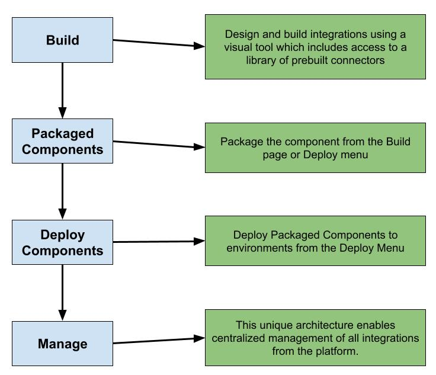

# Components

*Notes taken*: 06-16-2021

## Objectives

* Identify component
* Discuss packaged components workflow

**Components**:

* Reusable object
  * Listed in *Component Explorer*
* Created once and referenced across multiple shapes and multiple processes

---

## Understand Integration Scenario

*Notes taken*: 06-17-2021

* Form filled out by customer
  * Info stored on FTP Server in XML format
  * Build excel spreasheet with data
    * Convert to CSV before saving
