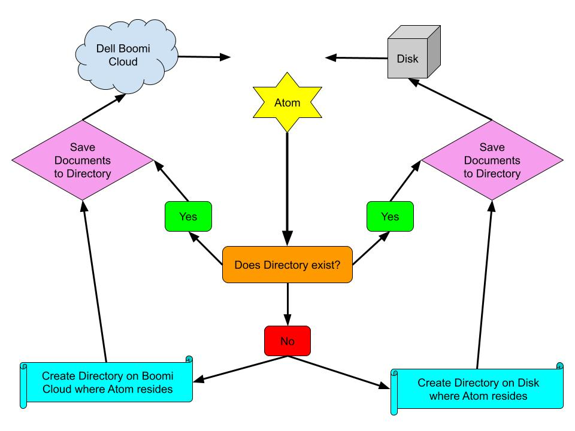

# Disk

*Notes taken*: 07-08-2021

Disk connectors are used to read and write from underlying file system of the host machine

## Objectives

* Locate Disk connector options
* Configure a Disk Connector

## Disk Connector: Options

The main component containing all of the information needed to connct to a single directory.

* Made up of 2 parts:
  * **Connection** - Directory definition
  * **Operation** - Get or Send: File Naming Options

## Disk Connection: Configuration

## Disck Operation: Configuration

* **Create Directory**: Creates directory on server during Process execution if it doesn't exist
* **File Naming Options**: Create "Unique/Overwrite/Append/Error" action when filename exists

---

## Activity: Create the Disk Connection

When developing a new process, it's recommended to create the process working from the outside in.

---

## Activity: Create a Disk Operation

* To successfully send an outbound document, you need to pair the disk operation with the connection component to show how to build the files and prevent errors
* It is Boomi recommended practice to store all your connections into one folder
* Green is good, red is dead